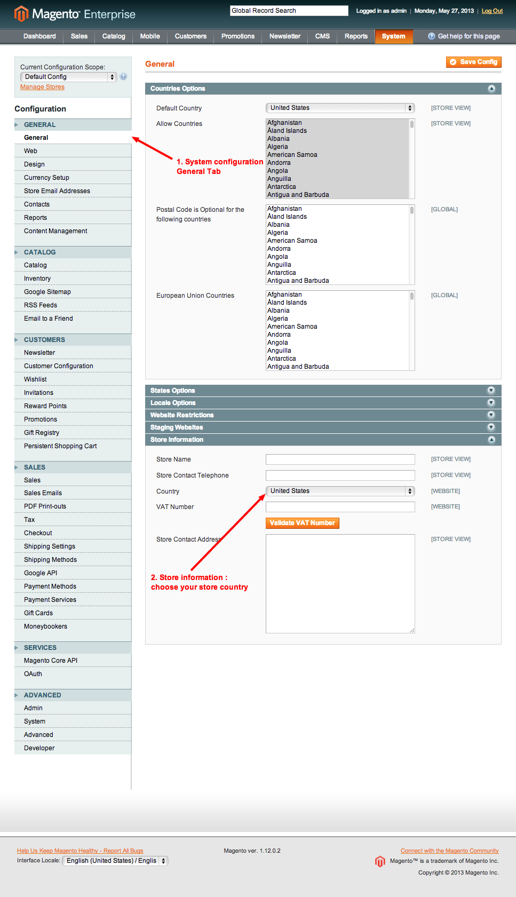
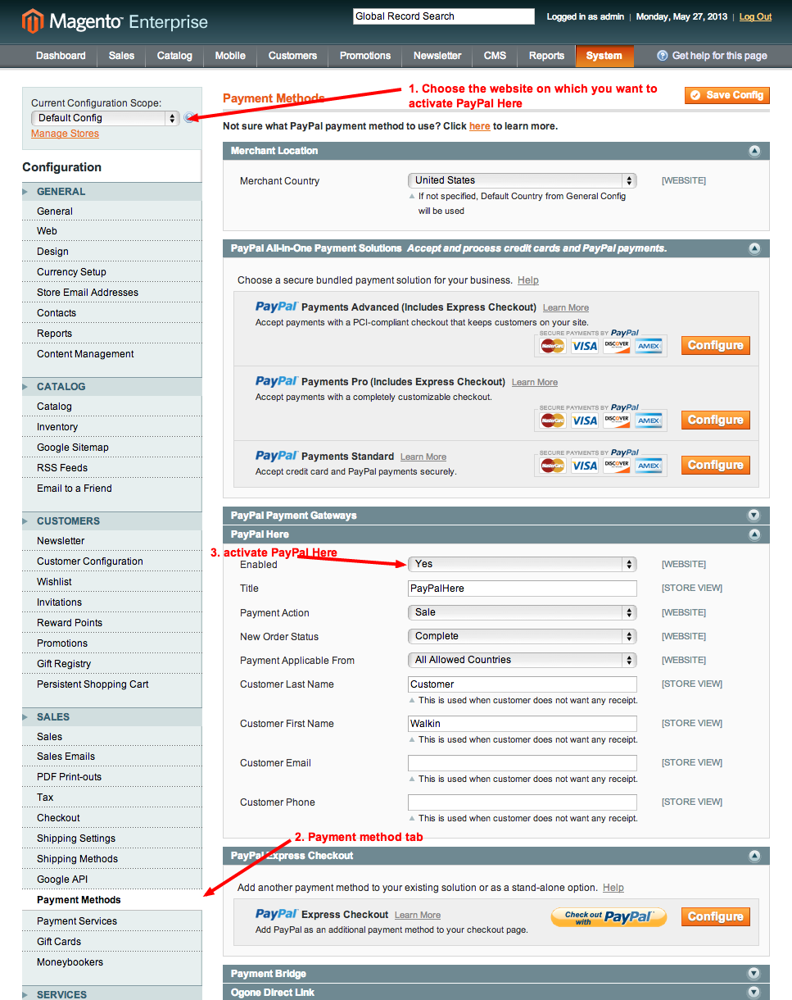
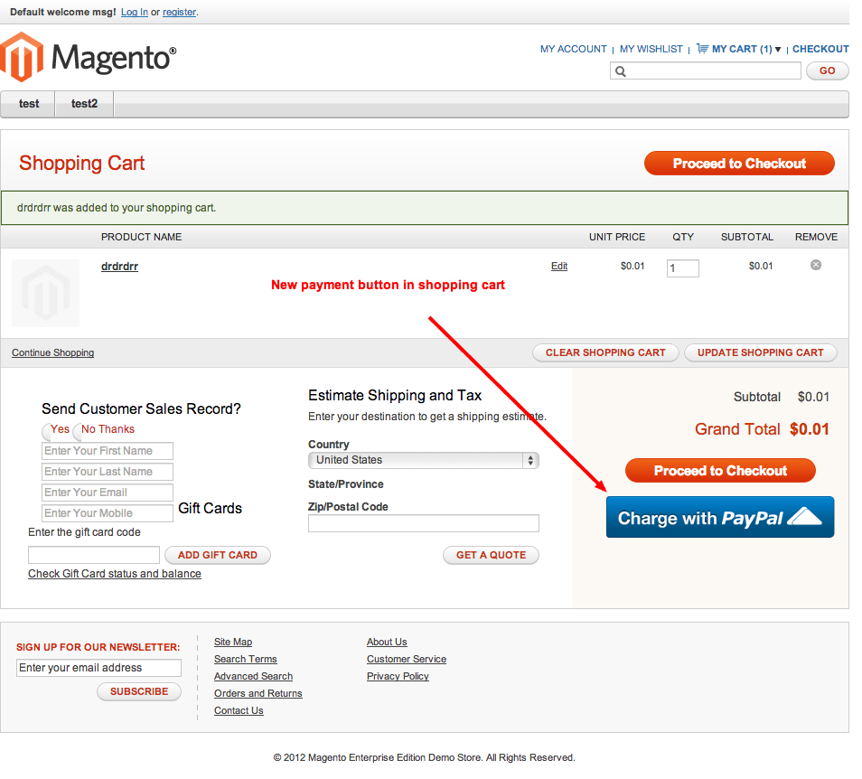

#PayPal In Aisle selling with Magento
#Getting Started Guide, version 1.0
##Table of Contents

1. Overview
2. Features
3. System Requirement
4. Prerequisites
5. Configuring PayPal Here module
6. Troubleshooting
 
##1. Overview

This setup guide is to enable PayPal In Aisle selling to be used with Magento.

“In-aisle selling” allows you to turn your Magento storefront into a "concierge" sales tool to service customers in the aisle or anywhere at your place of business, and then charge payment to the customer using PayPal Here installed on the same device.

This extension enables PayPal Here as a payment method on your Magento storefront. With PayPal Here you can accept payments several ways, including via "Check-in" from the PayPal app, credit or debit card, checks, cash, and by invoice.

Once installed, a "Charge with PayPal Here" button will be added to your shopping cart page. Clicking on "Charge with PayPal Here" will transfer the cart line items and customer details into PayPal Here installed on the same device. Once the transaction is successful, the transaction will be returned to Magento for completion and record keeping.

##2. Features

- Bypasses Magento 1-page checkout experience to provide a speedy checkout experience
- Adds "Charge with PayPal button" in shopping cart
- Add fields to collect customer name, email, and phone number on the shopping cart page for sending customers receipts
- If customer does not want a receipt, there's an option to opt out
- Sends shopping cart details to PayPal Here to complete payment through any of the available means - PayPal, Card, Cash, Check, or Invoice

##3. System Requirement

Your system must meet the following requirements:

* Magento Community 1.7 or Magento Enterprise 1.12 (If you are not sure what version you are running, log in to the Magento Admin Panel. The version displays at the bottom of the page).
* The latest version of this plugin on [magento connect](http://www.magentocommerce.com/magento-connect/catalog/product/view/id/17221/s/paypal-in-aisle-selling-6567/) or simply clone this repository.

##4. Prerequisites

Before you register your application and enable the PayPal Check-in into the Magento, please make sure all of the following are true:

* You have a PayPal account (Premier or Merchant Account), which is needed to register your application with PayPal.
* The web server on which Magento runs uses Secure Sockets Layer (SSL), which is also referred to as Secure HTTP or HTTPS to retrieve all the user attributes that Log In with PayPal supports.
* Magento Admin should be on full valid HTTPS URL throughout.

##5. Configuring PayPal Here module

1. Go to Magento, system > Configuration, general tab and make sure your store informations are correct

2. Activate free shipping

3. Activate PayPal Here

4. You should see a PayPal here button in the shopping cart

##6. Troubleshooting

No issue yet